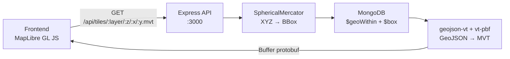
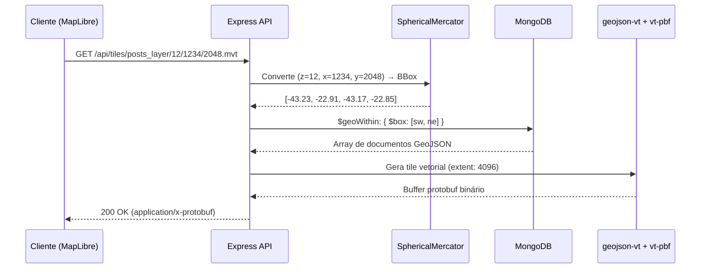

# 🌍 GeoMVT API

**API Node.js/TypeScript que serve dados geoespaciais do MongoDB como Mapbox Vector Tiles (MVT) utilizando o padrão XYZ de tiles, com frontend interativo em MapLibre GL JS.**

`Node.js` · `TypeScript` · `MongoDB` · `Express` · `MapLibre GL JS`

---

## Visão Geral

O **GeoMVT API** é uma aplicação completa para servir dados geoespaciais armazenados no MongoDB no formato **Mapbox Vector Tiles (MVT)**. O sistema converte coordenadas XYZ de tiles em bounding boxes geográficas, consulta o MongoDB utilizando índices espaciais e retorna tiles vetoriais binários no formato protobuf.

### Por que MVT?

| Vantagem | Descrição |
|---|---|
| **Performance** | Tiles vetoriais são significativamente menores que tiles rasterizados, reduzindo tráfego de rede |
| **Padrão aberto** | O formato MVT é uma especificação aberta da Mapbox, amplamente adotada pela indústria |
| **Renderização no cliente** | O navegador renderiza os vetores via WebGL, permitindo estilização dinâmica sem novas requisições ao servidor |
| **Interatividade** | Dados vetoriais permitem hover, click e filtragem diretamente no frontend |

### Arquitetura



---

## Pré-requisitos

Antes de iniciar, certifique-se de ter instalado:

| Ferramenta | Versão Mínima | Observação |
|---|---|---|
| **Node.js** | >= 18.x | Recomenda-se a versão LTS mais recente |
| **MongoDB** | >= 6.0 | Instância local ou [MongoDB Atlas](https://www.mongodb.com/atlas) |
| **npm** | >= 9.x | Incluído com o Node.js (ou utilize `yarn`) |

---

## Instalação e Setup

### 1. Clone o repositório

```bash
git clone <url-do-repositorio>
cd geo-mvt-api
```

### 2. Instale as dependências

```bash
npm install
```

### 3. Configure as variáveis de ambiente

Copie o arquivo de exemplo e ajuste conforme necessário:

```bash
cp .env.example .env
```

Edite o arquivo `.env`:

```env
PORT=3000
MONGODB_URI=mongodb://localhost:27017
DB_NAME=geo_mvt_db
```

> [!NOTE]
> Se estiver utilizando o MongoDB Atlas, substitua `MONGODB_URI` pela string de conexão fornecida no painel do Atlas.

### 4. Certifique-se de que o MongoDB está em execução

**Localmente:**

```bash
# Linux/macOS
sudo systemctl start mongod

# Windows (como serviço)
net start MongoDB
```

**Docker (alternativa rápida):**

```bash
docker run -d --name mongodb -p 27017:27017 mongo:7
```

### 5. Popule o banco de dados com dados de exemplo

```bash
npm run seed
```

Este comando insere **5.000 pontos GeoJSON** aleatórios no MongoDB, sendo 3.000 concentrados no Brasil e 2.000 distribuídos globalmente.

### 6. Inicie o servidor de desenvolvimento

```bash
npm run dev
```

### 7. Acesse a aplicação

Abra o navegador em **[http://localhost:3000](http://localhost:3000)** para visualizar o mapa interativo com os dados geoespaciais renderizados como tiles vetoriais.

> [!TIP]
> O servidor de desenvolvimento possui hot-reload — alterações no código fonte serão aplicadas automaticamente.

---

## Estrutura do Projeto

```
geo-mvt-api/
├── src/
│   ├── server.ts              # Ponto de entrada — inicializa Express e MongoDB
│   ├── routes/
│   │   └── tiles.ts           # Rota /api/tiles/:layer/:z/:x/:y.mvt
│   ├── services/
│   │   └── tileService.ts     # Lógica de geração de tiles (XYZ→BBox→Query→MVT)
│   ├── config/
│   │   └── database.ts        # Conexão e configuração do MongoDB
│   └── types/
│       └── index.ts           # Interfaces e tipos TypeScript
├── public/
│   ├── index.html             # Página principal com mapa MapLibre
│   └── style.css              # Estilos do frontend
├── scripts/
│   └── seed.ts                # Script de população do banco com dados geoespaciais
├── .env.example               # Modelo de variáveis de ambiente
├── tsconfig.json              # Configuração do TypeScript
├── package.json               # Dependências e scripts
└── README.md                  # Esta documentação
```

### Descrição dos Módulos

| Módulo | Responsabilidade |
|---|---|
| `src/server.ts` | Bootstrap da aplicação: configura middlewares, rotas, servir arquivos estáticos e conexão com MongoDB |
| `src/routes/tiles.ts` | Define o endpoint de tiles MVT com validação de parâmetros |
| `src/services/tileService.ts` | Converte coordenadas XYZ em BBox via `@mapbox/sphericalmercator`, consulta MongoDB e gera o tile MVT binário |
| `src/config/database.ts` | Gerencia a conexão com o MongoDB, incluindo reconexão automática |
| `public/` | Arquivos estáticos do frontend servidos pelo Express |
| `scripts/seed.ts` | Gera e insere 5.000 pontos GeoJSON aleatórios com distribuição geográfica controlada |

---

## Scripts Disponíveis

| Script | Comando | Descrição |
|---|---|---|
| **dev** | `npm run dev` | Inicia o servidor em modo de desenvolvimento com hot-reload (ts-node-dev ou tsx) |
| **build** | `npm run build` | Compila o TypeScript para JavaScript na pasta `dist/` |
| **start** | `npm start` | Executa o servidor compilado em produção a partir de `dist/` |
| **seed** | `npm run seed` | Popula o MongoDB com 5.000 pontos GeoJSON de exemplo |

---

## Fluxo de Dados

O diagrama abaixo detalha o caminho completo de uma requisição de tile, desde o frontend até a resposta binária:



### Passo a Passo Detalhado

#### 1. Requisição do cliente

O MapLibre GL JS requisita tiles automaticamente conforme o usuário navega e aplica zoom no mapa, utilizando o template de URL:

```
/api/tiles/{layer}/{z}/{x}/{y}.mvt
```

#### 2. Conversão XYZ → BBox

A biblioteca `@mapbox/sphericalmercator` converte as coordenadas de tile `(z, x, y)` em uma **bounding box** geográfica `[west, south, east, north]` no sistema de coordenadas WGS84 (EPSG:4326).

```typescript
const merc = new SphericalMercator({ size: 256 });
const bbox = merc.bbox(x, y, z);
// Resultado: [-43.23, -22.91, -43.17, -22.85]
```

#### 3. Consulta espacial no MongoDB

O servidor executa uma consulta `$geoWithin` com `$box` usando o índice `2dsphere` para buscar eficientemente apenas os documentos que intersectam a bounding box do tile solicitado.

```typescript
const features = await collection.find({
  geometry: {
    $geoWithin: {
      $box: [
        [bbox[0], bbox[1]], // sudoeste [lng, lat]
        [bbox[2], bbox[3]]  // nordeste [lng, lat]
      ]
    }
  }
}).toArray();
```

#### 4. Geração do tile vetorial

A biblioteca `geojson-vt` fatia os dados GeoJSON no tile correto com **extent 4096** (resolução interna do tile), e `vt-pbf` serializa o resultado no formato protobuf binário (MVT).

```typescript
const tileIndex = geojsonvt(featureCollection, { extent: 4096 });
const tile = tileIndex.getTile(z, x, y);
const buffer = vtpbf.fromGeojsonVt({ [layer]: tile });
```

#### 5. Resposta ao cliente

O buffer protobuf é enviado ao MapLibre com os headers apropriados. O MapLibre decodifica o tile e renderiza as features via WebGL.

---

## Decisões Técnicas

| Decisão | Alternativas Consideradas | Justificativa |
|---|---|---|
| **Express** como framework HTTP | Fastify, Koa, Hapi | Ecossistema maduro, ampla documentação, simplicidade para MVP. Migração para Fastify planejada no roadmap |
| **MongoDB `$geoWithin` + `$box`** | PostGIS, `$geoIntersects` | Operação mais rápida que `$geoIntersects` para bounding boxes retangulares, sem necessidade de SQL |
| **`geojson-vt` + `vt-pbf`** | `@mapbox/vector-tile`, `flatgeobuf` | Solução leve e bem testada para gerar MVT server-side a partir de GeoJSON puro |
| **MapLibre GL JS** | Mapbox GL JS, Leaflet, OpenLayers | Fork open-source do Mapbox GL JS sem necessidade de API key, suporte nativo a tiles vetoriais |
| **Índice `2dsphere`** | `2d` | Suporte a geometrias GeoJSON completas (pontos, linhas, polígonos) com cálculos esféricos precisos |
| **Extent 4096** | 256, 512 | Maior resolução interna do tile, resultando em renderização mais precisa de geometrias |
| **TypeScript** | JavaScript puro | Tipagem estática previne erros em runtime, melhora a experiência de desenvolvimento com autocomplete e refatoração segura |

---

## Próximos Passos (Roadmap Futuro)

- [ ] **Caching com Redis** — Cache de tiles gerados para reduzir consultas repetidas ao MongoDB
- [ ] **Suporte a múltiplas camadas** — Servir diferentes coleções como camadas independentes no mesmo tile
- [ ] **Clustering server-side** — Agrupamento de pontos em zooms baixos para melhorar a performance visual
- [ ] **WebSocket para dados em tempo real** — Notificação push quando novos dados geoespaciais forem inseridos
- [ ] **Migração para Fastify** — Melhor performance e suporte nativo a JSON Schema para validação de requests
- [ ] **Testes automatizados (Jest)** — Cobertura de testes unitários e de integração para rotas e serviços
- [ ] **Documentação OpenAPI/Swagger** — Geração automática de documentação interativa da API
- [ ] **Suporte a filtros por propriedade** — Query parameters para filtrar features por categoria, data e outros campos

---

## Licença

Este projeto está licenciado sob a **Licença MIT** — consulte o arquivo [LICENSE](./LICENSE) para detalhes.

```
MIT License

Copyright (c) 2025

Permission is hereby granted, free of charge, to any person obtaining a copy
of this software and associated documentation files (the "Software"), to deal
in the Software without restriction, including without limitation the rights
to use, copy, modify, merge, publish, distribute, sublicense, and/or sell
copies of the Software, and to permit persons to whom the Software is
furnished to do so, subject to the following conditions:

The above copyright notice and this permission notice shall be included in all
copies or substantial portions of the Software.

THE SOFTWARE IS PROVIDED "AS IS", WITHOUT WARRANTY OF ANY KIND, EXPRESS OR
IMPLIED, INCLUDING BUT NOT LIMITED TO THE WARRANTIES OF MERCHANTABILITY,
FITNESS FOR A PARTICULAR PURPOSE AND NONINFRINGEMENT. IN NO EVENT SHALL THE
AUTHORS OR COPYRIGHT HOLDERS BE LIABLE FOR ANY CLAIM, DAMAGES OR OTHER
LIABILITY, WHETHER IN AN ACTION OF CONTRACT, TORT OR OTHERWISE, ARISING FROM,
OUT OF OR IN CONNECTION WITH THE SOFTWARE OR THE USE OR OTHER DEALINGS IN THE
SOFTWARE.
```
