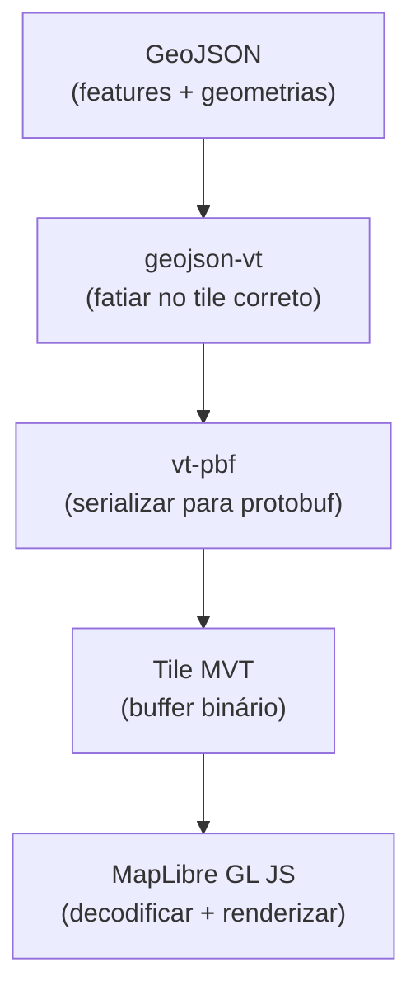
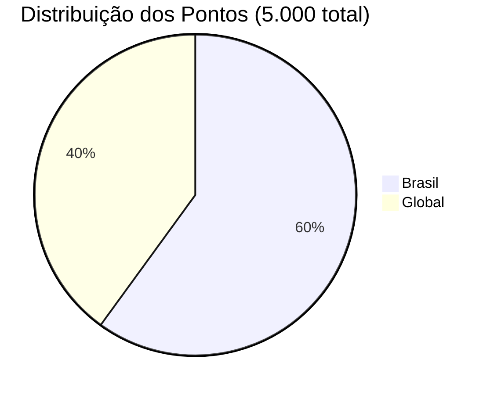

# 📡 API GeoMVT — Documentação de Endpoints

Documentação completa dos endpoints da API GeoMVT, incluindo parâmetros, formatos de resposta, códigos de status e exemplos de integração.

---

## Base URL

```
http://localhost:3000
```

> [!NOTE]
> A porta padrão é `3000`, configurável via variável de ambiente `PORT` no arquivo `.env`.

---

## Endpoints

### `GET /api/health`

Health check da aplicação. Utilize para verificar se o servidor está em execução e respondendo corretamente.

**Descrição:** Retorna o status de saúde da API com timestamp do momento da verificação.

#### Resposta

**Status `200 OK`**

```json
{
  "status": "ok",
  "timestamp": "2025-05-22T04:38:00.000Z"
}
```

| Campo | Tipo | Descrição |
|---|---|---|
| `status` | `string` | Status da API — sempre `"ok"` quando operacional |
| `timestamp` | `string` | Data/hora da resposta em formato ISO 8601 (UTC) |

#### Exemplo com cURL

```bash
curl -s http://localhost:3000/api/health | jq
```

**Resposta esperada:**

```json
{
  "status": "ok",
  "timestamp": "2025-05-22T04:38:00.000Z"
}
```

---

### `GET /api/tiles/:layer/:z/:x/:y.mvt`

Endpoint principal da API. Retorna um **Mapbox Vector Tile (MVT)** binário contendo as features geoespaciais que intersectam o tile solicitado.

**Descrição:** Recebe coordenadas de tile no padrão XYZ, consulta o MongoDB com operação `$geoWithin`, e retorna o tile vetorial no formato protobuf.

#### Parâmetros de URL

| Parâmetro | Tipo | Obrigatório | Descrição | Exemplo |
|---|---|---|---|---|
| `:layer` | `string` | Sim | Nome da collection no MongoDB que será consultada | `posts_layer` |
| `:z` | `integer` | Sim | Nível de zoom do tile (0–22). Zoom 0 = mundo inteiro, zoom 22 = máximo detalhe | `12` |
| `:x` | `integer` | Sim | Coordenada horizontal (coluna) do tile no nível de zoom especificado | `1234` |
| `:y` | `integer` | Sim | Coordenada vertical (linha) do tile no nível de zoom especificado | `2048` |

> [!IMPORTANT]
> Os valores de `:x` e `:y` devem estar dentro dos limites válidos para o nível de zoom informado. Para zoom `z`, os valores válidos são de `0` a `2^z - 1`.

#### Headers de Resposta

| Header | Valor | Descrição |
|---|---|---|
| `Content-Type` | `application/x-protobuf` | Indica que o corpo da resposta é um buffer protobuf binário (MVT) |
| `Content-Encoding` | `identity` | Sem compressão adicional no transporte |
| `Cache-Control` | `public, max-age=3600` | Cache de 1 hora — tiles podem ser cacheados por proxies e CDNs |
| `Access-Control-Allow-Origin` | `*` | CORS habilitado para qualquer origem |

#### Códigos de Status

| Código | Significado | Descrição |
|---|---|---|
| **200** | OK | Tile gerado com sucesso. O corpo contém o buffer protobuf com as features encontradas na região |
| **204** | No Content | Nenhuma feature encontrada na região do tile solicitado. Corpo vazio (tile sem dados) |
| **400** | Bad Request | Parâmetros inválidos — verifique se `z`, `x` e `y` são inteiros dentro dos limites válidos |
| **500** | Internal Server Error | Erro interno do servidor — falha na consulta ao MongoDB ou na geração do tile |

#### Exemplos com cURL

**Requisição de tile com dados (resposta binária salva em arquivo):**

```bash
curl -o tile.mvt http://localhost:3000/api/tiles/posts_layer/12/1234/2048.mvt
```

**Verificar headers de resposta:**

```bash
curl -I http://localhost:3000/api/tiles/posts_layer/10/300/500.mvt
```

**Resposta esperada dos headers:**

```
HTTP/1.1 200 OK
Content-Type: application/x-protobuf
Content-Encoding: identity
Cache-Control: public, max-age=3600
Access-Control-Allow-Origin: *
```

**Verificar se um tile contém dados (apenas status code):**

```bash
curl -s -o /dev/null -w "%{http_code}" \
  http://localhost:3000/api/tiles/posts_layer/5/10/15.mvt
```

- Retorno `200` → tile contém features
- Retorno `204` → tile vazio (sem dados nessa região)

#### Integração com MapLibre GL JS

Exemplo completo de como consumir os tiles vetoriais no frontend utilizando **MapLibre GL JS**:

```html
<!DOCTYPE html>
<html lang="pt-BR">
<head>
  <meta charset="UTF-8" />
  <meta name="viewport" content="width=device-width, initial-scale=1.0" />
  <title>GeoMVT — Mapa</title>
  <link
    rel="stylesheet"
    href="https://unpkg.com/maplibre-gl/dist/maplibre-gl.css"
  />
  <script src="https://unpkg.com/maplibre-gl/dist/maplibre-gl.js"></script>
  <style>
    body { margin: 0; padding: 0; }
    #map { width: 100vw; height: 100vh; }
  </style>
</head>
<body>
  <div id="map"></div>
  <script>
    const map = new maplibregl.Map({
      container: 'map',
      style: {
        version: 8,
        sources: {
          'osm-tiles': {
            type: 'raster',
            tiles: ['https://tile.openstreetmap.org/{z}/{x}/{y}.png'],
            tileSize: 256,
            attribution: '&copy; OpenStreetMap contributors'
          }
        },
        layers: [
          {
            id: 'osm-base',
            type: 'raster',
            source: 'osm-tiles'
          }
        ]
      },
      center: [-47.9, -15.8], // Brasília
      zoom: 4
    });

    map.on('load', () => {
      // Adiciona a source de tiles vetoriais do GeoMVT
      map.addSource('geomvt', {
        type: 'vector',
        tiles: ['http://localhost:3000/api/tiles/posts_layer/{z}/{x}/{y}.mvt'],
        minzoom: 0,
        maxzoom: 14
      });

      // Renderiza os pontos como círculos
      map.addLayer({
        id: 'geomvt-points',
        type: 'circle',
        source: 'geomvt',
        'source-layer': 'posts_layer',
        paint: {
          'circle-radius': 5,
          'circle-color': '#007cbf',
          'circle-stroke-width': 1,
          'circle-stroke-color': '#ffffff'
        }
      });

      // Popup ao clicar em um ponto
      map.on('click', 'geomvt-points', (e) => {
        const feature = e.features[0];
        new maplibregl.Popup()
          .setLngLat(e.lngLat)
          .setHTML(`
            <strong>${feature.properties.title}</strong><br/>
            Categoria: ${feature.properties.category}<br/>
            Criado em: ${feature.properties.createdAt}
          `)
          .addTo(map);
      });

      // Cursor pointer ao passar sobre os pontos
      map.on('mouseenter', 'geomvt-points', () => {
        map.getCanvas().style.cursor = 'pointer';
      });
      map.on('mouseleave', 'geomvt-points', () => {
        map.getCanvas().style.cursor = '';
      });
    });
  </script>
</body>
</html>
```

> [!TIP]
> O campo `source-layer` deve corresponder ao nome da camada (parâmetro `:layer` na URL). No exemplo acima, utilizamos `posts_layer`.

---

## Formato dos Dados

### O que é MVT?

O **Mapbox Vector Tile (MVT)** é um formato binário baseado em **Protocol Buffers (protobuf)** para codificar dados geográficos vetoriais. Diferente de tiles rasterizados (imagens PNG/JPEG), os tiles vetoriais contêm geometrias e propriedades que são renderizadas no lado do cliente via WebGL.



**Características do formato:**

| Característica | Valor |
|---|---|
| **Encoding** | Protocol Buffers (protobuf) |
| **Extensão** | `.mvt` ou `.pbf` |
| **Content-Type** | `application/x-protobuf` |
| **Extent** (resolução interna) | 4096 unidades |
| **Sistema de coordenadas** | Coordenadas internas relativas ao tile |
| **Especificação** | [Mapbox Vector Tile Specification v2](https://github.com/mapbox/vector-tile-spec) |

### Estrutura GeoJSON de uma Feature

Cada documento armazenado no MongoDB segue a estrutura GeoJSON abaixo. Esses documentos são consultados, convertidos em tiles vetoriais e servidos ao cliente:

```json
{
  "_id": "664e1a2b3f4c5d6e7f8a9b0c",
  "type": "Feature",
  "geometry": {
    "type": "Point",
    "coordinates": [-43.1729, -22.9068]
  },
  "properties": {
    "title": "Evento Cultural no Centro",
    "category": "evento",
    "createdAt": "2025-05-22T04:38:00.000Z"
  }
}
```

### Propriedades Disponíveis

As seguintes propriedades estão presentes em cada feature retornada no tile vetorial:

| Propriedade | Tipo | Descrição | Exemplo |
|---|---|---|---|
| `title` | `string` | Título descritivo do ponto geoespacial | `"Alerta de Chuva Forte"` |
| `category` | `string` | Categoria classificatória da feature (veja valores abaixo) | `"alerta"` |
| `createdAt` | `string` | Data de criação em formato ISO 8601 (UTC) | `"2025-05-22T04:38:00.000Z"` |

#### Categorias

As features são classificadas em uma das seguintes categorias:

| Categoria | Descrição |
|---|---|
| `evento` | Eventos culturais, esportivos ou sociais |
| `notícia` | Notícias e acontecimentos locais |
| `alerta` | Alertas meteorológicos, de segurança ou emergências |
| `promoção` | Ofertas e promoções comerciais geolocalizadas |
| `informação` | Informações gerais e pontos de interesse |

---

## Seed Data

### O que o script faz

O script de seed (`npm run seed`) popula o banco de dados MongoDB com **5.000 pontos GeoJSON** gerados aleatoriamente, simulando um cenário realista de dados geoespaciais.

### Distribuição Geográfica



| Região | Quantidade | Percentual | Observação |
|---|---|---|---|
| **Brasil** | 3.000 | 60% | Coordenadas distribuídas dentro dos limites geográficos do Brasil (lat: -33° a 5°, lng: -74° a -35°) |
| **Global** | 2.000 | 40% | Coordenadas distribuídas aleatoriamente por todo o globo (lat: -90° a 90°, lng: -180° a 180°) |

### Processo de Seed

1. Conecta ao MongoDB usando a URI configurada no `.env`
2. Remove dados anteriores da collection (se existirem)
3. Gera 3.000 pontos com coordenadas aleatórias dentro do Brasil
4. Gera 2.000 pontos com coordenadas aleatórias globais
5. Atribui propriedades aleatórias (`title`, `category`, `createdAt`) a cada ponto
6. Insere todos os documentos na collection `posts_layer`
7. Cria o índice `2dsphere` no campo `geometry`

### Execução

```bash
npm run seed
```

**Saída esperada:**

```
Conectando ao MongoDB...
Conexão estabelecida com sucesso.
Removendo dados anteriores...
Gerando 5000 pontos GeoJSON...
  → 3000 pontos no Brasil
  → 2000 pontos globais
Inserindo documentos...
Criando índice 2dsphere...
Seed concluído! 5000 documentos inseridos.
```

> [!WARNING]
> Executar o seed novamente **remove todos os dados existentes** na collection antes de inserir os novos. Utilize com cautela em ambientes com dados reais.

---

## Referências

- [Mapbox Vector Tile Specification](https://github.com/mapbox/vector-tile-spec)
- [MapLibre GL JS — Documentação](https://maplibre.org/maplibre-gl-js/docs/)
- [MongoDB — Geospatial Queries](https://www.mongodb.com/docs/manual/geospatial-queries/)
- [GeoJSON — RFC 7946](https://datatracker.ietf.org/doc/html/rfc7946)
- [`geojson-vt` — GitHub](https://github.com/mapbox/geojson-vt)
- [`vt-pbf` — GitHub](https://github.com/mapbox/vt-pbf)
- [`@mapbox/sphericalmercator` — GitHub](https://github.com/mapbox/sphericalmercator)
